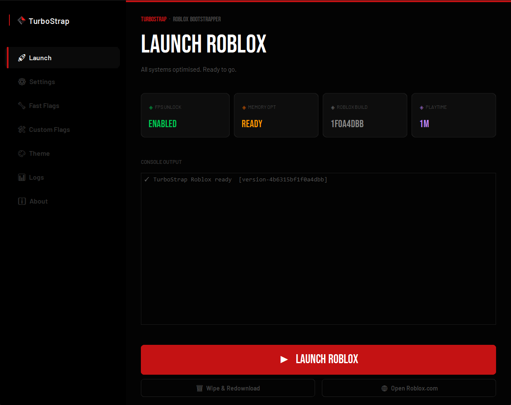

# Hi, I'm Rajveer! 👋

I’m a **self-taught developer** passionate about building cool projects and solving problems through code. I enjoy experimenting with new technologies and constantly leveling up my skills.

---

### ⏳ Currently Working On
*I am currently developing **TurboStrap**, a custom Roblox bootstrapper. Check it out here:* [turbostrap.rf.gd](http://turbostrap.rf.gd)

  

---

### 📈 GitHub Stats

  
  

---

### 🌐 Let's Connect
Feel free to reach out for collaborations or just to say hi!

* **Instagram:** [@naklirajveer](https://instagram.com/naklirajveer)
* **Email:** [naklirajveer@gmail.com](mailto:naklirajveer@gmail.com)

---

### 🛠 Tech Stack

    
    
   &nbsp;
   &nbsp;
   &nbsp;
   &nbsp;
   &nbsp;
  
  
  

---

