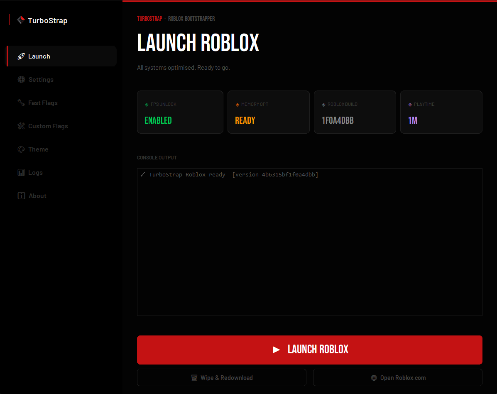

           `.:/ossyyyysso/:.                rajveer@t630-linux
        .:oyyyyyyyyyyyyyyyyyyo:`            ------------------
      -oyyyyyyyodMMyyyyyyyysyyyyo-          OS: Kubuntu 25.10 (Questing Quokka) x86_64
    -syyyyyyyyyydMMyoyyyydmMMyyyyys-        Host: HP t630 Thin Client
   oyyysdMysyyyydMMMMMMMMMMMMMyyyyyyyo      Kernel: Linux 6.17.0-5-generic
 `oyyyydMMMMysyysoooooodMMMMyyyyyyyyyo`     Uptime: 1 hour, 47 mins
 oyyyyyydMMMMyyyyyyyyyyyysdMMysssssyyyo     Packages: 2296 (dpkg), 7 (snap)
-yyyyyyyydMysyyyyyyyyyyyyyysdMMMMMysyyy-    Shell: bash 5.2.37
oyyyysoodMyyyyyyyyyyyyyyyyyyydMMMMysyyyo    Display (AAA): 1600x900 @ 60 Hz in 26" [External] *
yyysdMMMMMyyyyyyyyyyyyyyyyyyysosyyyyyyyy    Display (RGT1352): 1366x768 @ 60 Hz in 7" [External]
yyysdMMMMMyyyyyyyyyyyyyyyyyyyyyyyyyyyyyy    DE: KDE Plasma 6.4.5
oyyyyysosdyyyyyyyyyyyyyyyyyyydMMMMysyyyo    WM: KWin (Wayland)
-yyyyyyyydMysyyyyyyyyyyyyyysdMMMMMysyyy-    WM Theme: Carl
 oyyyyyydMMMysyyyyyyyyyyysdMMyoyyyoyyyo     Theme: Darkly (BreezeDark) [Qt], Breeze-Dark [GTK2], Breeze [GTK3/4]oyyyydMMMysyyyoooooodMMMMyoyyyyyyyyo
   oyyysyyoyyyysdMMMMMMMMMMMyyyyyyyyo       Icons: Tela-dark [Qt], Tela-dark [GTK2/3/4]
    -syyyyyyyyydMMMysyyydMMMysyyyys-        Font: Noto Sans (10pt) [Qt], Noto Sans (10pt) [GTK2/3/4]
      -oyyyyyyydMMyyyyyyysosyyyyo-          Cursor: Sweet (24px)
        ./oyyyyyyyyyyyyyyyyyyo/.            Terminal: konsole 25.8.1
           `.:/oosyyyysso/:.`               CPU: AMD Embedded G-Series GX-420GI Radeon R7E (4) @ 2.00 GHz
                                            GPU: AMD Radeon R7E Graphics [Integrated]
                                            Memory: 2.59 GiB / 6.73 GiB (38%)
                                            Swap: 0 B / 512.00 MiB (0%)
                                            Disk (/): 12.04 GiB / 72.69 GiB (17%) - ext4
                                            Local IP (enx46fdc2745a46): 172.21.64.25/24
                                            Locale: en_IN

                                                                    
                                                                    
rajveer@t630-linux:~$ ^C

# Hi, I'm Rajveer! 👋

I’m a **self-taught developer** passionate about building cool projects and solving problems through code. I enjoy experimenting with new technologies and constantly leveling up my skills.

---

### ⏳ Currently Working On
*I am currently developing **TurboStrap**, a custom Roblox bootstrapper. Check it out here:* [turbostrap.rf.gd](http://turbostrap.rf.gd)

  

---

### 📈 GitHub Stats

  
  

---

### 🌐 Let's Connect
Feel free to reach out for collaborations or just to say hi!

* **Instagram:** [@naklirajveer](https://instagram.com/naklirajveer)
* **Email:** [naklirajveer@gmail.com](mailto:naklirajveer@gmail.com)

---

### 🛠 Tech Stack

    
    
   &nbsp;
   &nbsp;
   &nbsp;
   &nbsp;
   &nbsp;
   &nbsp;
   &nbsp;
   &nbsp;
  

   &nbsp;
   &nbsp;
   &nbsp;
  
  

---

